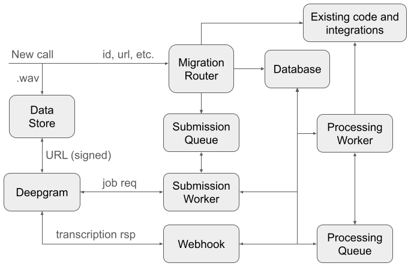
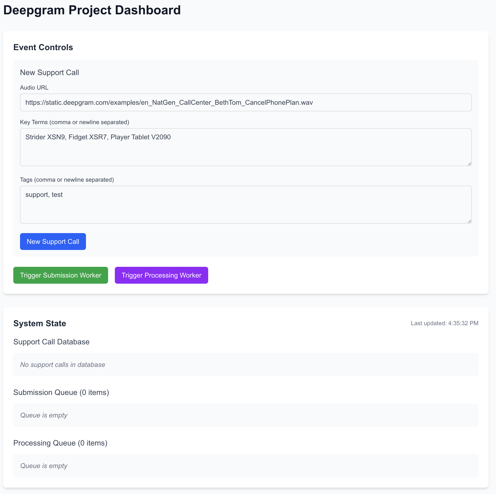

# Project Description

This project demonstrates how a customer can migrate their existing support call transcription workflow to a new STT system (Deepgram).

The following is the architecture of the project:



- First, a new call is recorded, saved to a data store, and the information about the call (such as ID, URL, keyterms, etc.) is sent to the migration router.
- The migration router routes the call to the existing code, while routing a subset of the calls to the Deepgram STT system.
- The ID of the call is stored in the submission queue.
- When a submission worker is available, and is able to submit a call to Deepgram, it picks up the call from the submission queue and submits it to Deepgram.
- The Deepgram webhook receives the response from Deepgram, stores the response into the database, and creates a new entry in the processing queue.
- When a processing worker is available, it picks up the call from the processing queue, and processes the call. It can format the response from Deepgram to an existing format for existing integrations (database, transcripts, CRM, etc.)

# Instructions

### Environment Setup

1. Sign up for a tunneling service such as [Ngrok](https://ngrok.com/).

2. Create a `.env` file in the project root with the following variables:

```bash
DEEPGRAM_API_KEY=your_deepgram_api_key_here
DEEPGRAM_API_KEY_IDENTIFIER=your_deepgram_api_key_identifier_here
TUNNEL_URL=your-custom-domain
```

3. Run the development server

```bash
npm run dev
```

4. Start your tunnel (if using Ngrok)

```bash
ngrok http 3000
```

5. Open [http://localhost:3000](http://localhost:3000) with your browser to see the dashboard.

### Using the Dashboard

The following is the dashboard page:



- The New Support Call form allows you to submit a new support call to the migration router. You can specify the audio URL, key terms, and tags.
- Press the New Support Call button to create a new call in the database and the submission queue.
- Press the Trigger Submission Worker button to submit the call to Deepgram.
- You will notice that the status of the call changes to "Transcribing" in the database.
- When the call is transcribed, the status will be changed to "Processing", and a new entry will be created in the processing queue.
- Press the Trigger Processing Worker button to process the call.
- You will notice that the status of the call changes to "Processed" in the database.
- You can view the response from Deepgram by clicking on the call in the database.

# File Descriptions

### Configurations and Types

- `src/lib/config.ts`: Configurations such as default audio URL, key terms, etc.
- `src/lib/models.ts`: Types for the database, submission queue, and processing queue.

### Main Components

- `src/app/api/migration-router/route.ts`: Migration router.
- `src/app/api/dg-submission-worker/route.ts`: Submission worker.
- `src/app/api/dg-webhook/route.ts`: Deepgram webhook.
- `src/app/api/dg-processing-worker/route.ts`: Processing worker.

### Mock Components

- `src/lib/database.ts`: Mock database.
- `src/lib/dg-submission-queue.ts`: Mock submission queue.
- `src/lib/dg-processing-queue.ts`: Mock processing queue.

### Other Components

- `src/app/page.tsx`: Dashboard UI.
- `src/app/api/observability/route.ts`: Observability endpoint.
